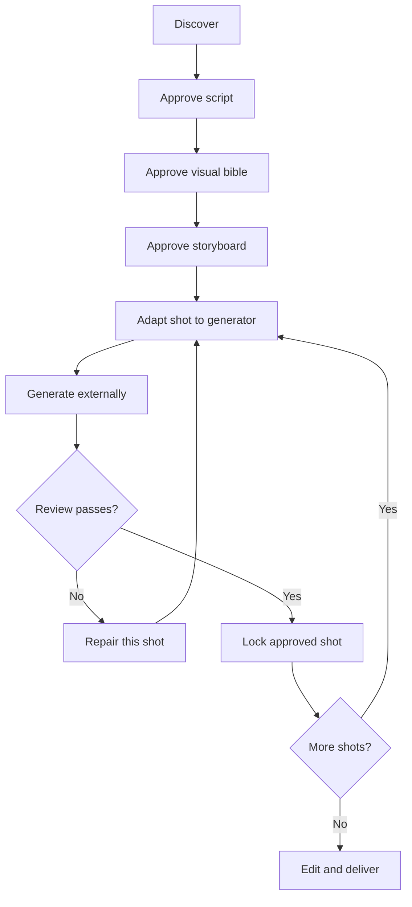

# Workflow architecture

```mermaid
flowchart TD
A[Discover] --> B[Approve script]
B --> C[Approve visual bible]
C --> D[Approve storyboard]
D --> E[Adapt shot to generator]
E --> F[Generate externally]
F --> G{Review passes?}
G -- No --> H[Repair this shot]
H --> E
G -- Yes --> I[Lock approved shot]
I --> J{More shots?}
J -- Yes --> E
J -- No --> K[Edit and deliver]
```
The Project Bible preserves decisions and approvals across sessions. Rendering is handled by external tools.